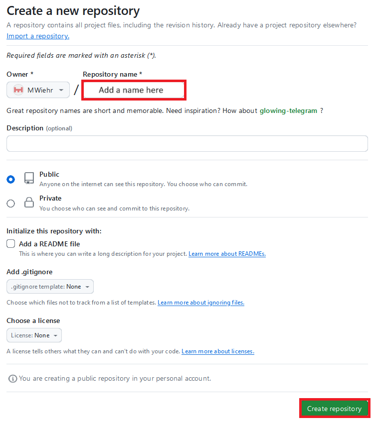

# Connecting our local repository to GitHub

Our project is fully version controlled so we have access to a detailed history of every change we've ever made to it. This is a great first step but all of this only exists on our own computers at the moment.

It's time to upload our project to GitHub!

Putting your code on GitHub confers a number of benefits:

* Everything is backed up for you.
* Your project is made available to others. This is a vital part of modern scientific dissemination.
* GitHub has a range of project management and collaboration tools that work on a per-project basis.
* Your GitHub profile can be used as part of your online-identity.

**Creating a new repository on GitHub**

* Log into GitHub and go to your profile page. On the **repositories** tab, click **New**

 

At the **Create a new repository** screen, give your repo a name and click **Create Repository**.



The **Quick Setup** screen gives sets of git commands that can be used in various circumstances.  
First, make sure you select the SSH tab (the url shown in the blue box should start with git@github.com).  
We are then interested in **…or push an existing repository from the command line**. Copy these commands to the clipboard using the copy button on GitHub. 


In RStudio, navigate to the **git** tab and click on **More -> New terminal**


<br/>

Paste the git commands into the Shell and press Enter to execute them.
Given this is your first push, you may be asked again to authenticate your identity by entering the password of your SSH key


and/or prompted with such sentence in the terminal:

```
Are you sure you want to continue connecting (yes/no/[fingerprint])?
```
to which you should answer `yes`  

<br/>

> **Warning for Windows OS with RStudio > 2022.12.0**
> If you get an error saying you do not have a SSH key in the appropriate location, this is due to a <a href="https://community.rstudio.com/t/git-bash-uses-different-home-directory-in-rstudio-2022-12-0-on-windows/155508">known bug in the RStudio / Git bash interaction</a> which we expect to be eventually resolved with updates. A temporary solution is to open the Windows Power Shell instead of Git Bash as terminal within RStudio: for this, go to RStudio -> Tools -> Global Options -> Terminal -> New terminals open with -> choose Windows Power Shell -> Click Apply -> close the panel -> Complete the steps above (i.e. paste or type the commands presented by your new GitHub repo) -> change back the default terminal within RStudio to Git Bash.

<br/>

Finally, confirm that the project has been uploaded to your GitHub profile (you may need to refresh your GitHub page).

***

[Previous](./viewing_history.md) | [Next](./updates.md)
